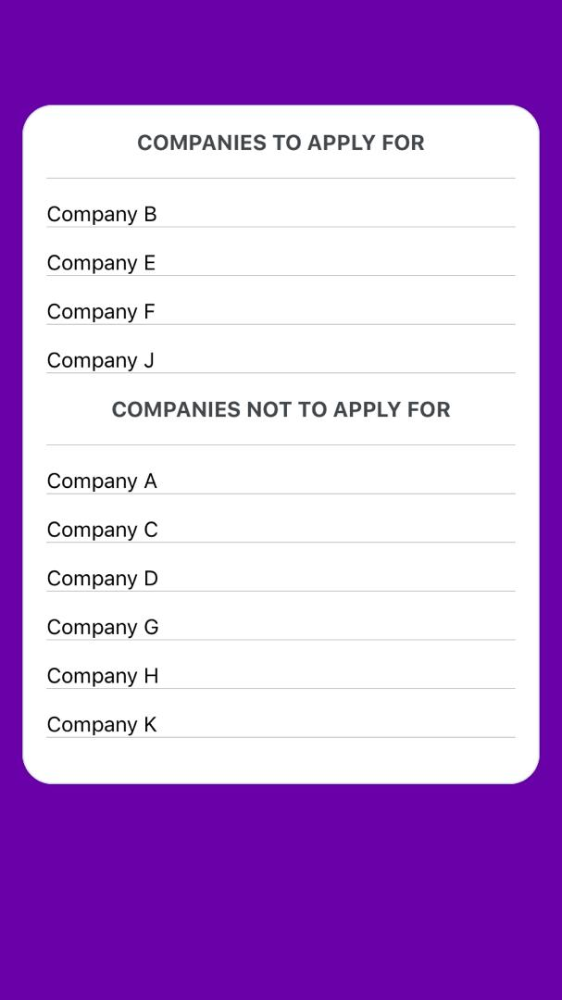

# Company_Selection_App

The task in the repo is to write code that will calculate for which companies you can work with and for which you can't.

# Format of Input

The source code consists of an input file called 'InputFile' that consists of the input string that is a list of companies available . The companies must be in the same format as the example

# How Task was archieved

With The help of Regular Expressions the input string was matched with instances of both Driver's license and Bike occurences inorder to generate both the valid companies and those that are not valid
 
Below is how the component shall look like

